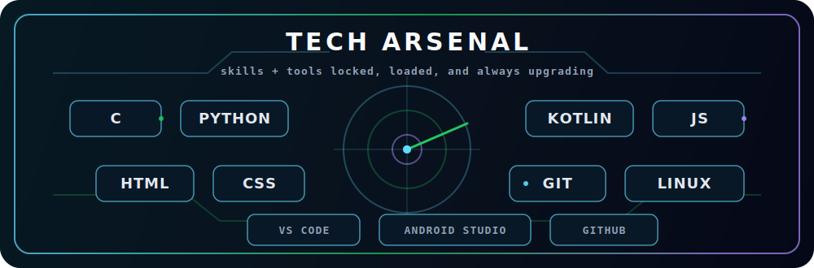
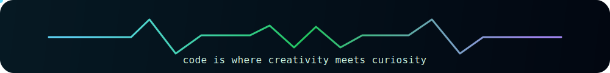

  

  

## Mission Control

I'm **Susnata Biswas**, an **Electronics & Telecommunication Engineering student** who loves **coding, mathematics, and technology**.

- Building practical projects while strengthening my coding portfolio
- Learning programming, data science, electronics, and Android development
- Sharing ideas and notes on [my blog](https://susnatacodes.blogspot.com)
- Turning curiosity into code, and ideas into impact

 

  

## Connect Grid

  
  
  
  
  

<!-- Add your LinkedIn URL here when ready:

-->

  

## Tech Arsenal

  

  
   
  

  

## Featured Builds

| Project | Tech | Focus |
| --- | --- | --- |
| [SUSNATA-WEATHER-APP](https://github.com/SUSNATACODES/SUSNATA-WEATHER-APP) | JavaScript | Weather app and API practice |
| [DigitalDrawingAssist](https://github.com/SUSNATACODES/DigitalDrawingAssist) | Kotlin | Digital drawing assistance project |
| [BARNEE-SLIDER](https://github.com/SUSNATACODES/BARNEE-SLIDER) | HTML | UI slider experiment |

  

## Current Goals

- Build a solid coding portfolio with practical projects
- Keep improving as a student and developer
- Mix electronics concepts with programming
- Share useful content with the community

  

