  

  

## Connect

  
  
  
  
  

<!-- Add your LinkedIn URL here when ready:

-->

## Mission

I'm **Susnata Biswas**, an **Electronics & Telecommunication Engineering student** building practical projects with code, math, and electronics.

- Building a strong coding portfolio with real projects
- Learning programming, data science, electronics, and Android development
- Sharing ideas and notes on [my blog](https://susnatacodes.blogspot.com)
- Turning curiosity into code, and ideas into impact

## Stack

  
   
  

## Featured Projects

| Project | Tech | Why it matters |
| --- | --- | --- |
| [SUSNATA-WEATHER-APP](https://github.com/SUSNATACODES/SUSNATA-WEATHER-APP) | JavaScript | API practice with a useful weather interface |
| [DigitalDrawingAssist](https://github.com/SUSNATACODES/DigitalDrawingAssist) | Kotlin | Android and creative tooling practice |
| [BARNEE-SLIDER](https://github.com/SUSNATACODES/BARNEE-SLIDER) | HTML | UI interaction and frontend experiment |

## Build Philosophy

**Learn the concept. Build the project. Share the journey. Repeat.**
