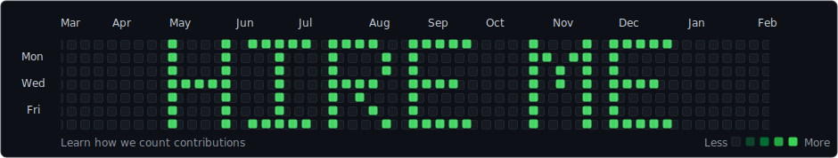

  

  
  
  
  
  

## 👋 About Me

I'm **Susnata Biswas**, an **Electronics & Telecommunication Engineering student** with a passion for **coding, mathematics, and technology**.

- 🔭 Building practical projects while strengthening my coding portfolio
- 🌱 Learning more about programming, data science, and electronics
- ✍️ Sharing ideas and notes on [my blog](https://susnatacodes.blogspot.com)
- 💡 Turning curiosity into code, and ideas into impact

---

## 🧠 Skills

  

---

## ⚙️ Tools

  

---

## 🚀 Featured Projects

| Project | Tech | Focus |
| --- | --- | --- |
| [SUSNATA-WEATHER-APP](https://github.com/SUSNATACODES/SUSNATA-WEATHER-APP) | JavaScript | Weather app and API practice |
| [DigitalDrawingAssist](https://github.com/SUSNATACODES/DigitalDrawingAssist) | Kotlin | Digital drawing assistance project |
| [BARNEE-SLIDER](https://github.com/SUSNATACODES/BARNEE-SLIDER) | HTML | UI slider experiment |

---

## 📊 GitHub Statistics

  

  

  
  

---

## 🧩 Most Used Languages

  
  

---

## 🎯 Goals

- Build a **solid coding portfolio** with practical projects
- Keep improving as a **student and developer**
- Share useful content with the community

---

## 🎉 Fun Side

- 😀 Fan of **XKCD** and **PhD Comics**
- 🤓 Love mixing **electronics concepts with programming**
- 📚 Believe in *learning → building → sharing*

---

  <i>Code is where creativity meets curiosity.</i> ✨

